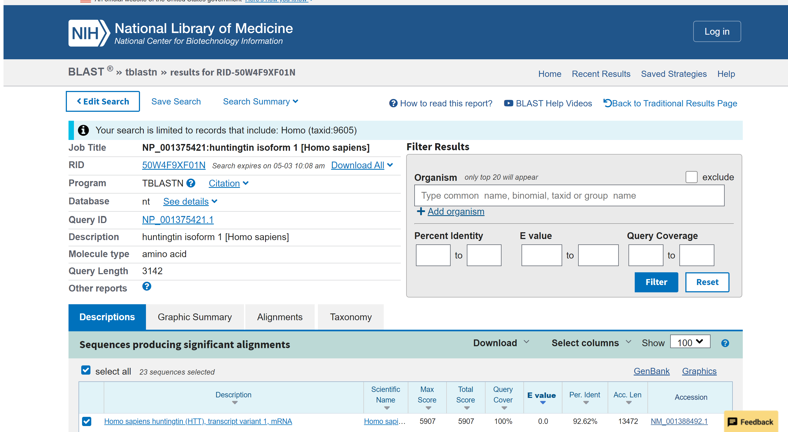

```{r setup, include=FALSE}
knitr::opts_chunk$set(echo = TRUE)
```

## Question 1

**Tell me the name of a protein you are interested in. Include the
species and the accession number. This can be a human protein or a
protein from any other species as long as its function is known. If you
do not have a favorite protein, select human RBP4 or KIF11. Do not use
beta globin as this is in the worked example report that I provide you
with online.**

> I am interested in studying the huntingtin (Htt) protein, specifically
> huntingtin isoform 1, which is involved in Huntington's Disease. This
> protein is found in humans (Homo sapiens) and its accession number
> from NCBI RefSeq is NP_001375421.1.
>
> Link: <https://www.ncbi.nlm.nih.gov/protein/NP_001375421.1>

## Question 2

**Perform a BLAST search against a DNA database, such as a database
consisting of genomic DNA or ESTs. The BLAST server can be at NCBI or
elsewhere. Include details of the BLAST method used, database searched
and any limits applied (e.g. Organism). Also include the output of that
BLAST search in your document. If appropriate, change the font to
Courier size 10 so that the results are displayed neatly. You can also
screen capture a BLAST output (e.g. alt print screen on a PC or on a MAC
press . The pointer becomes a bulls eye. Select the area you wish to
capture and release. The image is saved as a file called Screen Shot
[].png in your Desktop directory). It is not necessary to print out all
of the blast results if there are many pages. On the BLAST results,
clearly indicate a match that represents a protein sequence, encoded
from some DNA sequence, that is homologous to your query protein. I need
to be able to inspect the pairwise alignment you have selected,
including the E value and score. It should be labeled a "genomic clone"
or "mRNA sequence", etc. - but include no functional annotation. In
general, [Q2] is the most difficult for students because it requires you
to have a "feel" for how to interpret BLAST results. You need to
distinguish between a perfect match to your query (i.e. a sequence that
is not "novel"), a near match (something that might be "novel",
depending on the results of [Q4]), and a non-homologous result. If you
are having trouble finding a novel gene try restricting your search to
an organism that is poorly annotated.**

> I used NCBI BLAST, specifically tblastn, to find genes relating to the
> huntingtin isoform 1 protein (NP_001375421.1) with the organism set to
> Homo (taxid: 9605). The database I searched was the nucleotide
> collection (nt) database. The top hit was Homo sapiens huntingtin
> (HTT), transcript variant 1, mRNA, which corresponds to Homo sapiens
> (humans), has a query cover of 100%, an E-value of 0.0, a percent
> identity of 92.62%, and the accession number NM_001388492.1.
> Screenshot is attached with results from the BLAST search.

  

## Question 3

**Gather information about this "novel" protein. At a minimum, show me
the protein sequence of the "novel" protein as displayed in your BLAST
results from [Q2] as FASTA format (you can copy and paste the aligned
sequence subject lines from your BLAST result page if necessary) or
translate your novel DNA sequence using a tool called EMBOSS Transeq at
the EBI. Don't forget to translate all six reading frames; the ORF (open
reading frame) is likely to be the longest sequence without a stop
codon. It may not start with a methionine if you don't have the complete
coding region. Make sure the sequence you provide includes a
header/subject line and is in traditional FASTA format. Here, tell me
the name of the novel protein, and the species from which it derives. It
is very unlikely (but still definitely possible) that you will find a
novel gene from an organism such as S. cerevisiae, human or mouse,
because those genomes have already been thoroughly annotated. It is more
likely that you will discover a new gene in a genome that is currently
being sequenced, such as bacteria or plants or protozoa.**

> The protein I found is from humans and is called huntingtin isoform 1.
>
> 

> FASTA file contents for the protein I chose:
>
> \>NP_001375421.1 huntingtin isoform 1 [Homo sapiens]
>
> MATLEKLMKAFESLKSFQQQQQQQQQQQQQQQQQQQQQPPPPPPPPPPPQLPQPPPQAQPLLPQPQPPPPPPPPPPGPAVAEEPLHRPKKELSATKKDRVNHCLTICENIVAQSVRNSPEFQKLLGIAMELFLLCSDDAESDVRMVADECLNKVIKALMDSNLPRLQLELYKEIKKNGAPRSLRAALWRFAELAHLVRPQKCRPYLVNLLPCLTRTSKRPEESVQETLAAAVPKIMASFGNFANDNEIKVLLKAFIANLKSSSPTIRRTAAGSAVSICQHSRRTQYFYSWLLNVLLGLLVPVEDEHSTLLILGVLLTLRYLVPLLQQQVKDTSLKGSFGVTRKEMEVSPSAEQLVQVYELTLHHTQHQDHNVVTGALELLQQLFRTPPPELLQTLTAVGGIGQLTAAKEESGGRSRSGSIVELIAGGGSSCSPVLSRKQKGKVLLGEEEALEDDSESRSDVSSSALTASVKDEISGELAASSGVSTPGSAGHDIITEQPRSQHTLQADSVDLASCDLTSSATDGDEEDILSHSSSQVSAVPSDPAMDLNDGTQASSPISDSSQTTTEGPDSAVTPSDSSEIVLDGTDNQYLGLQIGQPQDEDEEATGILPDEASEAFRNSSMALQQAHLLKNMSHCRQPSDSSVDKFVLRDEATEPGDQENKPCRIKGDIGQSTDDDSAPLVHCVRLLSASFLLTGGKNVLVPDRDVRVSVKALALSCVGAAVALHPESFFSKLYKVPLDTTEYPEEQYVSDILNYIDHGDPQVRGATAILCGTLICSILSRSRFHVGDWMGTIRTLTGNTFSLADCIPLLRKTLKDESSVTCKLACTAVRNCVMSLCSSSYSELGLQLIIDVLTLRNSSYWLVRTELLETLAEIDFRLVSFLEAKAENLHRGAHHYTGLLKLQERVLNNVVIHLLGDEDPRVRHVAAASLIRLVPKLFYKCDQGQADPVVAVARDQSSVYLKLLMHETQPPSHFSVSTITRIYRGYNLLPSITDVTMENNLSRVIAAVSHELITSTTRALTFGCCEALCLLSTAFPVCIWSLGWHCGVPPLSASDESRKSCTVGMATMILTLLSSAWFPLDLSAHQDALILAGNLLAASAPKSLRSSWASEEEANPAATKQEEVWPALGDRALVPMVEQLFSHLLKVINICAHVLDDVAPGPAIKAALPSLTNPPSLSPIRRKGKEKEPGEQASVPLSPKKGSEASAASRQSDTSGPVTTSKSSSLGSFYHLPSYLKLHDVLKATHANYKVTLDLQNSTEKFGGFLRSALDVLSQILELATLQDIGKCVEEILGYLKSCFSREPMMATVCVQQLLKTLFGTNLASQFDGLSSNPSKSQGRAQRLGSSSVRPGLYHYCFMAPYTHFTQALADASLRNMVQAEQENDTSGWFDVLQKVSTQLKTNLTSVTKNRADKNAIHNHIRLFEPLVIKALKQYTTTTCVQLQKQVLDLLAQLVQLRVNYCLLDSDQVFIGFVLKQFEYIEVGQFRESEAIIPNIFFFLVLLSYERYHSKQIIGIPKIIQLCDGIMASGRKAVTHAIPALQPIVHDLFVLRGTNKADAGKELETQKEVVVSMLLRLIQYHQVLEMFILVLQQCHKENEDKWKRLSRQIADIILPMLAKQQMHIDSHEALGVLNTLFEILAPSSLRPVDMLLRSMFVTPNTMASVSTVQLWISGILAILRVLISQSTEDIVLSRIQELSFSPYLISCTVINRLRDGDSTSTLEEHSEGKQIKNLPEETFSRFLLQLVGILLEDIVTKQLKVEMSEQQHTFYCQELGTLLMCLIHIFKSGMFRRITAAATRLFRSDGCGGSFYTLDSLNLRARSMITTHPALVLLWCQILLLVNHTDYRWWAEVQQTPKRHSLSSTKLLSPQMSGEEEDSDLAAKLGMCNREIVRRGALILFCDYVCQNLHDSEHLTWLIVNHIQDLISLSHEPPVQDFISAVHRNSAASGLFIQAIQSRCENLSTPTMLKKTLQCLEGIHLSQSGAVLTLYVDRLLCTPFRVLARMVDILACRRVEMLLAANLQSSMAQLPMEELNRIQEYLQSSGLAQRHQRLYSLLDRFRLSTMQDSLSPSPPVSSHPLDGDGHVSLETVSPDKDWYVHLVKSQCWTRSDSALLEGAELVNRIPAEDMNAFMMNSEFNLSLLAPCLSLGMSEISGGQKSALFEAAREVTLARVSGTVQQLPAVHHVFQPELPAEPAAYWSKLNDLFGDAALYQSLPTLARALAQYLVVVSKLPSHLHLPPEKEKDIVKFVVATLEALSWHLIHEQIPLSLDLQAGLDCCCLALQLPGLWSVVSSTEFVTHACSLIYCVHFILEAVAVQPGEQLLSPERRTNTPKAISEEEEEVDPNTQNPKYITAACEMVAEMVESLQSVLALGHKRNSGVPAFLTPLLRNIIISLARLPLVNSYTRVPPLVWKLGWSPKPGGDFGTAFPEIPVEFLQEKEVFKEFIYRINTLGWTSRTQFEETWATLLGVLVTQPLVMEQEESPPEEDTERTQINVLAVQAITSLVLSAMTVPVAGNPAVSCLEQQPRNKPLKALDTRFGRKLSIIRGIVEQEIQAMVSKRENIATHHLYQAWDPVPSLSPATTGALISHEKLLLQINPERELGSMSYKLGQVSIHSVWLGNSITPLREEEWDEEEEEEADAPAPSSPPTSPVNSRKHRAGVDIHSCSQFLLELYSRWILPSSSARRTPAILISEVVRSLLVVSDLFTERNQFELMYVTLTELRRVHPSEDEILAQYLVPATCKAAAVLGMDKAVAEPVSRLLESTLRSSHLPSRVGALHGVLYVLECDLLDDTAKQLIPVISDYLLSNLKGIAHCVNIHSQQHVLVMCATAFYLIENYPLDVGPEFSASIIQMCGVMLSGSEESTPSIIYHCALRGLERLLLSEQLSRLDAESLVKLSVDRVNVHSPHRAMAALGLMLTCMYTGKEKVSPGRTSDPNPAAPDSESVIVAMERVSVLFDRIRKGFPCEARVVARILPQFLDDFFPPQDIMNKVIGEFLSNQQPYPQFMATVVYKVFQTLHSTGQSSMVRDWVMLSLSNFTQRAPVAMATWSLSCFFVSASTSPWVAAILPHVISRMGKLEQVDVNLFCLVATDFYRHQIEEELDRRAFQSVLEVVAAPGSPYHRLLTCLRNVHKVTTC

## Question 4

**Prove that this gene, and its corresponding protein, are novel. For
the purposes of this project, "novel" is defined as follows. Take the
protein sequence (your answer to [Q3]), and use it as a query in a
blastp search of the nr database at NCBI. • If there is a match with
100% amino acid identity to a protein in the database, from the same
species, then your protein is NOT novel (even if the match is to a
protein with a name such as "unknown"). Someone has already found and
annotated this sequence, and assigned it an accession number. • If the
top match reported has less than 100% identity, then it is likely that
your protein is novel, and you have succeeded. • If there is a match
with 100% identity, but to a different species than the one you started
with, then you have likely succeeded in finding a novel gene. • If there
are no database matches to the original query from [Q1], this indicates
that you have partially succeeded: yes, you may have found a new gene,
but no, it is not actually homologous to the original query. You should
probably start over.**

> There are other proteins with percent identities less than 100%, but
> the top hit is 100%, since I used that exact sequence as the blastp
> query. Therefore, my protein is not novel?


